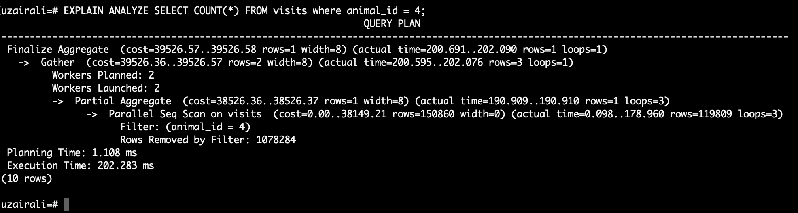
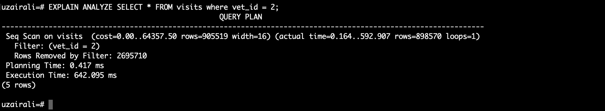
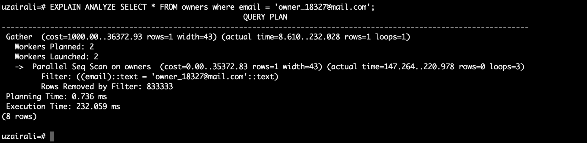
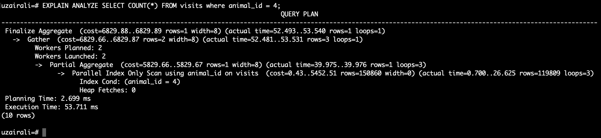
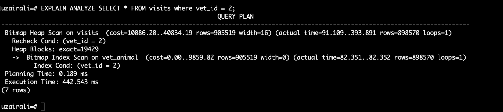
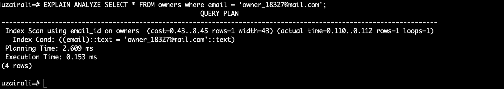

# Vet Clinic Database

> This project is demonstrating the way the databases take time and optimize the queries used to extract data.

## Solution to optimize data

While creating queries we should use indexes to extract data from relational databases. This saves execution time and lets the database respond in less time. This way we can make sure the data that is being fetched from the server is using optimal server response time.

## Before Optimizing Queries

## After Optimizing Queries

## Built With

- PostgreSQL
- CLI (Command Line Interface)

## Authors

👤 **Uzair Ali**

- GitHub: [@uzairali](https://github.com/uzairali19)
- Twitter: [@uzairali751](https://twitter.com/Uzairali751)
- LinkedIn: [Uzair Ali](https://www.linkedin.com/in/uzairali19/)

## 🤝 Contributing

Contributions, issues, and feature requests are welcome!

Feel free to check the [issues page](https://github.com/uzairali19/vet-clinic-sql/issues/).

## Show your support

Give a ⭐️ if you like this project!

## 📝 License

This project is [MIT](./MIT.md) licensed.